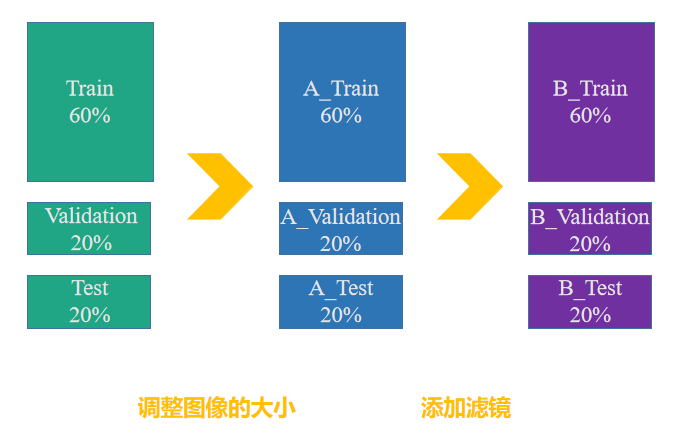
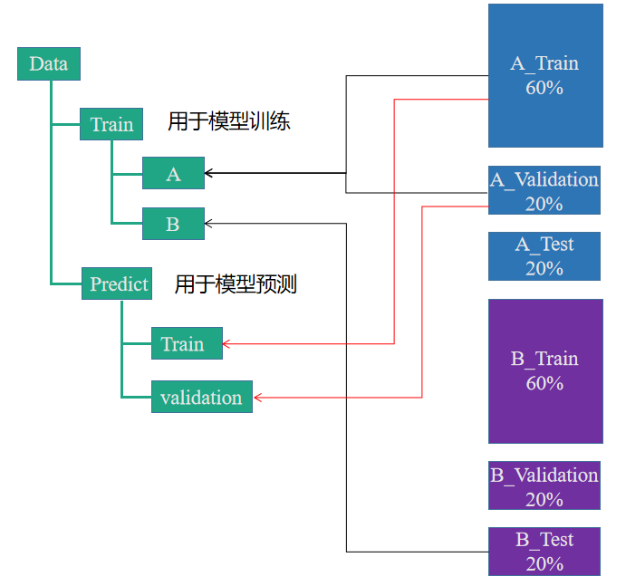
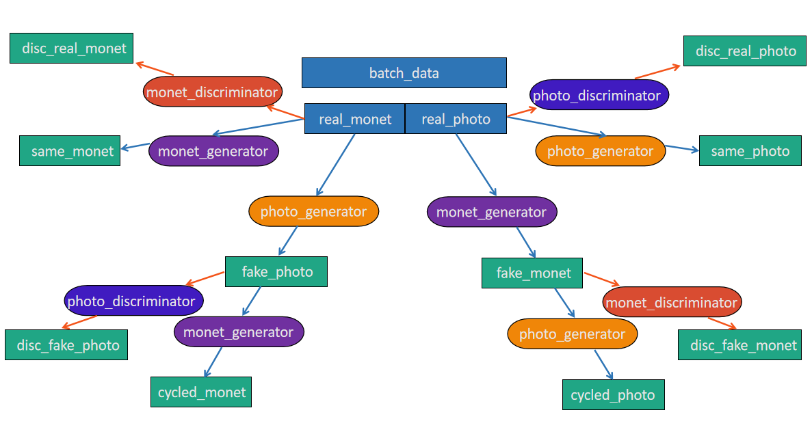
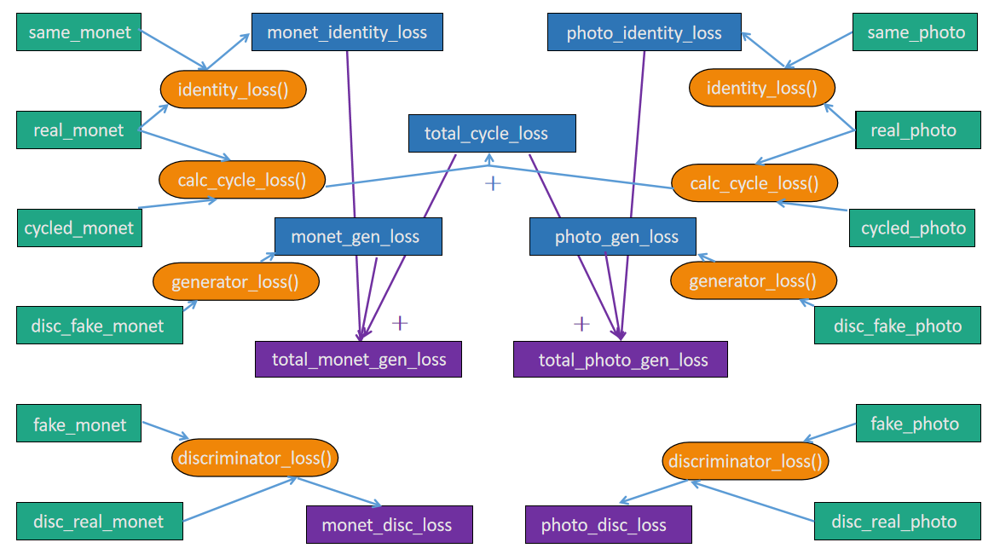
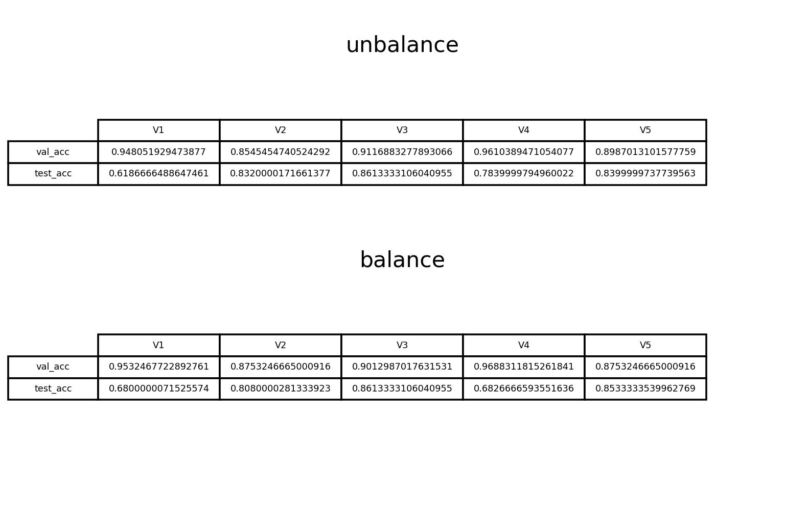

# Research on Data Augmentation Method Based on Style Transfer

## Abstraction

At present, deep learning has been widely used in computer vision tasks such as image classification and object detection. However, in practical application scenarios, because the actual image and the image used for training the model are not unified in terms of lighting conditions, filter styles, etc., the prediction performance of the model in the actual scene is often greatly reduced.

If the actual image is re-labeled and the model is trained, it will bring huge labeling cost. Traditional data augmentation methods are mostly based on pre-set rules, which can enhance the diversity of images in the training set and help improve the generalization performance of the model. However, such methods do not consider targeted data enhancement for real images. However, based on the style transfer technology, the style of the training set images is transferred to the actual image style, and the annotation labels are kept unchanged, and a training set with annotated results that is close to the style of the specific actual image set will be generated, and the model will be trained based on the migrated data set. Or fine-tuning an existing model will help improve the prediction performance of the model in specific real-world scenarios.

This topic studies the data augmentation method based on style transfer, and evaluates its improvement effect on the model prediction performance on the image classification task through experiments.

## Method

Here, the training set of [Plant Pathology 2020 - FGVC7](https://www.kaggle.com/competitions/plant-pathology-2020-fgvc7) on Kaggle is borrowed, and it is re-divided into training set, validation set and test set, and filters are added to all data to obtain new style data. Use the training set and validation set of the original image data to perform style transfer learning between the test set of the new style image data, and then transfer the style of the training set and validation set of the original image data to obtain the style-transferred training set and validation set. In this way, four sets of data are obtained: training set and validation set of original image data, training set and validation set of image data after style transfer, training set and validation set of new style image data, and test set of new style image data. Select an appropriate deep learning classification model, and use the original data, the style-transferred data, and the training set and validation set corresponding to the new style data for training, to obtain the trained model 1, model 2, and model 3. Use these three models to make classification predictions on the test set of the new style data, and compare the classification effects of the three classification models.

## Code

+ The first step is image preprocessing, including data set division, adding filters to images, building directories, etc.(See [MyStep1](https://www.kaggle.com/code/sssbanana/mystep1))
+ The output of the first step is used to build the dataset.(See [step1tostep2](https://www.kaggle.com/datasets/sssbanana/step1tostep2))
+ The second step is to use the CycleGAN method for style transfer, including loading the dataset, building the generator and discriminator, building the CycleGAN model, training the CycleGAN model, and using the CycleGAN model for prediction.(See [MyStep2](https://www.kaggle.com/code/sssbanana/mystep2))
+ The output of the second step is used to build the dataset.(See [step2tostep3](https://www.kaggle.com/datasets/sssbanana/step2tostep3))
+ The third step is preprocessing before using the classification model.(See [MyStep3](https://www.kaggle.com/code/sssbanana/mystep3))
+ The output of the third step is used to build the dataset.(See [step3tostep4](https://www.kaggle.com/datasets/sssbanana/step3tostep4))
+ The fourth step has one code, but ten versions. Each version is saved on Kaggle, they just have different parameters (Step, BALANCE). For example, MyStep4.1b means that Step is V1 and BALANCE is True. MyStep4.5u means that Step is V5 and BALANCE is False. The version can be changed by changing Step and BALANCE.(Take MyStep4.5b as an example, just to see [MyStep4.5b](https://www.kaggle.com/code/sssbanana/mystep4-5b)))
+ The fifth step is to sort out the experimental results of the above ten versions.(See [MyStep5](https://www.kaggle.com/code/sssbanana/mystep5))

## details

1. Image preprocessing before style transfer.

2. The construction of the dataset [step1tostep2](https://www.kaggle.com/datasets/sssbanana/step1tostep2).

3. Obtaining the variables of the train_step method of the CycleGAN class.

4. Obtaining the losses of the train_step method of the CycleGAN class.

5. Example of image comparison before and after style transfer.

6. The construction of the dataset [step3tostep4](https://www.kaggle.com/datasets/sssbanana/step3tostep4).

7. The five versions of the classification model.

8. The result of [MyStep5](https://www.kaggle.com/code/sssbanana/mystep5)

